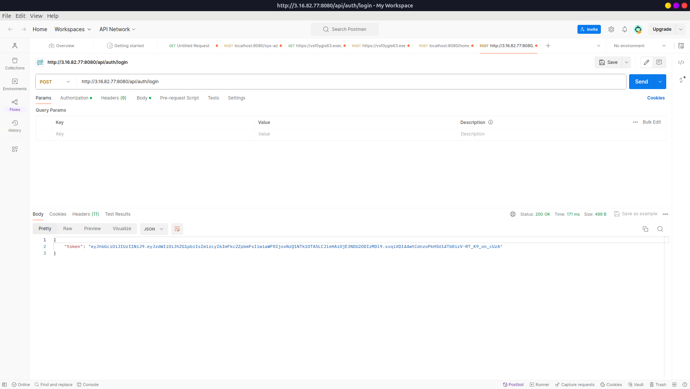
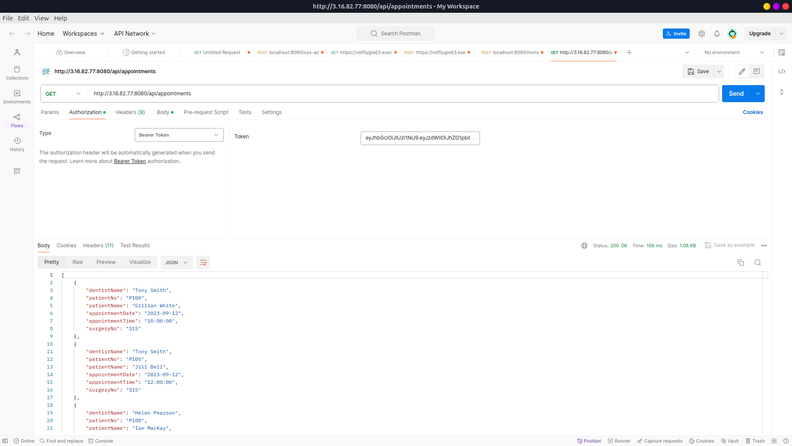
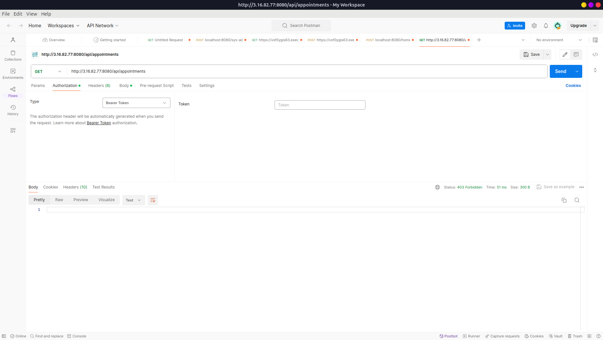
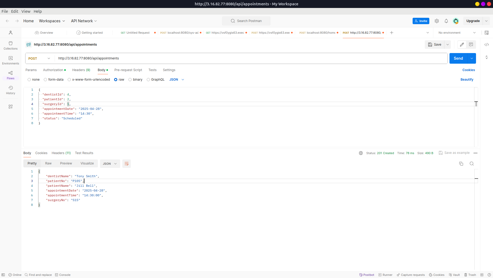
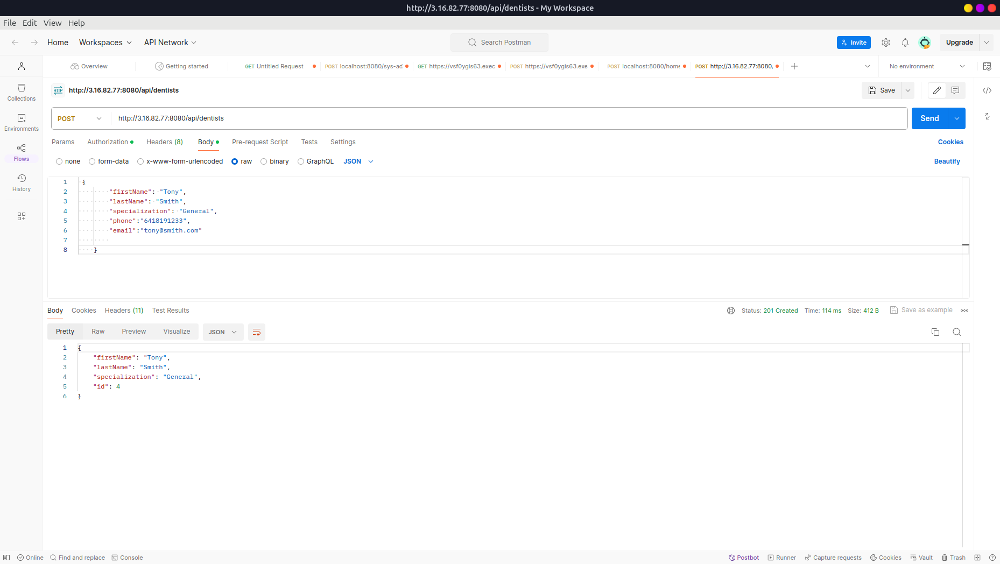
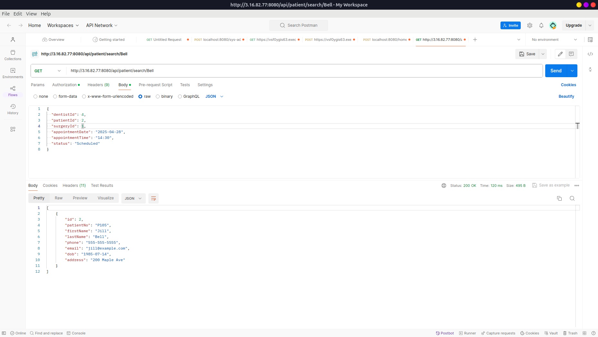

# 🦷 Dental Appointments Management System
This is a Spring Boot RESTful API designed for managing dental clinic operations. It allows clinics to manage Patients, Dentists, Appointments, and Bills efficiently. The system provides secure authentication, detailed search capabilities, and a clean data model using Spring Data JPA. The application is containerized using Docker and uses MySQL as the relational database.

## 🖼️ SCREENSHOTS

### 🔐 Auth with Bearer Token

### 📋 Get Appointments

### ❌ Access Denied (Unauthorized)

### ➕ Create Appointment

### ➕ Create Dentist

### 🔍 Get Dentist by ID

### 🔎 Search Patient by Last Name

